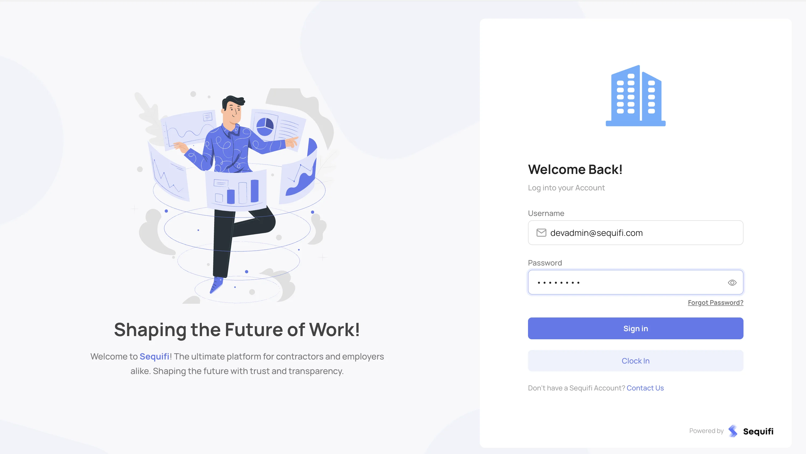
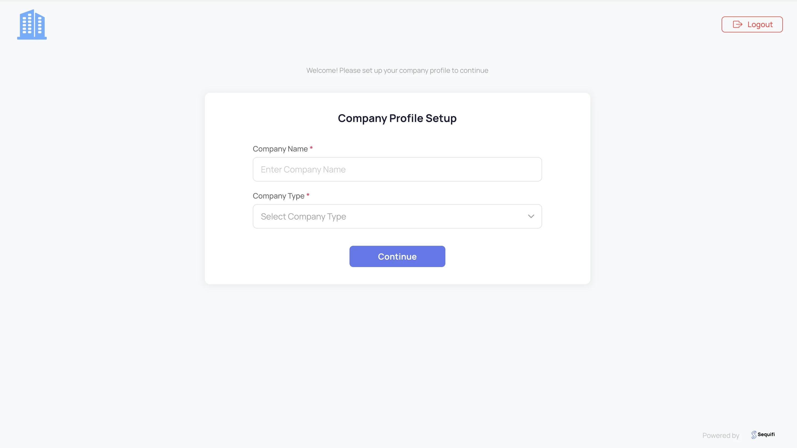
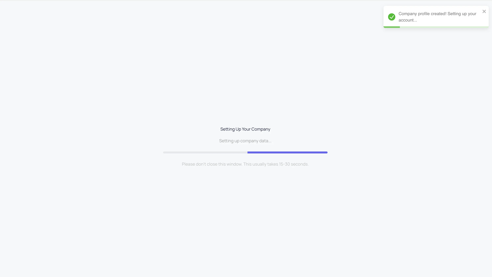
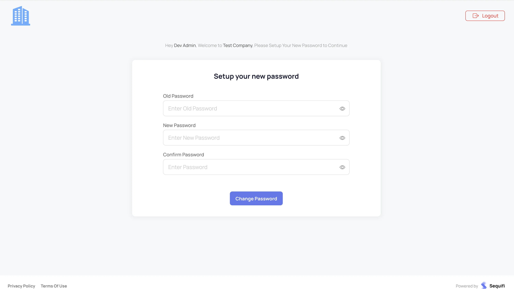

# Sequifi Backend

Laravel-based backend API for the Sequifi platform, providing comprehensive CRM, sales management, payroll processing, and third-party integrations.

## Quick Start

```bash
# 1. Clone and install dependencies
git clone <repository-url> sequifi-backend && cd sequifi-backend
composer install

# 2. Configure environment
cp .env.example .env
# Edit .env with your database credentials

# 3. Generate key and setup database
php artisan key:generate
mysql -u root -p -e "CREATE DATABASE sequifi CHARACTER SET utf8mb4 COLLATE utf8mb4_unicode_ci;"
php artisan migrate:fresh --seed

# 4. Start the application
php artisan serve

# 5. In a new terminal, start the queue worker (required!)
php artisan queue:work
```

Visit `http://localhost:8000` - You're ready! 🚀

> **Note**: Keep both terminals running (server + queue worker) for full functionality.  
> **First Time?** See the [First Time Setup & Login Flow](#first-time-setup--login-flow) section for screenshots of the initial setup process.

---

## Table of Contents

- [Tech Stack](#tech-stack)
- [Prerequisites](#prerequisites)
- [Installation](#installation)
- [Configuration](#configuration)
- [Database Setup](#database-setup)
- [Optional Setup](#optional-setup)
- [Running the Application](#running-the-application)
  - [First Time Setup & Login Flow](#first-time-setup--login-flow)
- [Development Workflow](#development-workflow)
- [Queue Workers & Background Jobs](#queue-workers--background-jobs)
- [Testing](#testing)
- [API Documentation](#api-documentation)
- [Deployment](#deployment)
- [Third-Party Integrations](#third-party-integrations)
- [Troubleshooting](#troubleshooting)
- [Additional Resources](#additional-resources)

---

## Tech Stack

### Core Framework

- **Laravel**: 10.48+
- **PHP**: 8.1+ (8.3+ recommended)
- **Laravel Octane**: 2.3+ (Swoole server for high performance)
- **Laravel Horizon**: 5.39+ (Redis queue monitoring)

### Database Systems

- **MySQL**: Primary database with read/write split support
- **MongoDB**: Document storage (SequifiArena)
- **SQLite**: Domain-specific databases and API metrics
- **Redis**: Cache, queues, and session management

### Key Libraries

- **Authentication**: Laravel Sanctum 3.3+
- **AWS SDK**: S3 storage, SES email, SDK 3.343+
- **PDF Generation**: DomPDF 2.0+
- **Excel Processing**: Maatwebsite Excel 3.1+
- **Real-time**: Pusher PHP Server 7.2+
- **Analytics**: Google BigQuery 1.32+, ClickHouse
- **Error Tracking**: Sentry Laravel 4.13+
- **Activity Logging**: Spatie Activity Log 4.7+
- **API Documentation**: L5 Swagger
- **QuickBooks**: QuickBooks V3 PHP SDK 6.2+

### Frontend Assets

- **CSS Framework**: Bootstrap 5.2.2
- **JavaScript**: jQuery, DataTables, Chart.js, CKEditor

---

## Prerequisites

Before you begin, ensure you have the following installed:

### Required Software

1. **PHP 8.1+** (8.3+ recommended) with extensions:
    - php-xml
    - php-curl
    - php-mbstring
    - php-zip
    - php-gd
    - php-intl
    - php-bcmath
    - php-mysql
    - php-mongodb
    - php-redis
    - php-sqlite3
    - php-swoole (for Laravel Octane)

2. **Composer 2.2.0+**: PHP dependency manager

    ```bash
    composer --version
    ```

3. **MySQL 8.0+**: Primary database

    ```bash
    mysql --version
    ```

4. **Redis 6.0+**: Cache and queue driver
    ```bash
    redis-server --version
    ```

### Optional Software

- **MongoDB 5.0+**: If using SequifiArena features
- **Git**: For version control

---

## Installation

### 1. Clone the Repository

```bash
git clone <repository-url> sequifi-backend
cd sequifi-backend
```

### 2. Install PHP Dependencies

```bash
composer install
```

> **Note**: For production, use `composer install --no-dev --optimize-autoloader`

### 3. Environment Configuration

Copy the example environment file:

```bash
cp .env.example .env
```

Edit `.env` and update these critical settings:

- **Database credentials**: `DB_DATABASE`, `DB_USERNAME`, `DB_PASSWORD`
- **Application URL**: `APP_URL`, `BASE_URL`
- **Redis connection** (if using queues/cache): `REDIS_HOST`, `REDIS_PORT`

> **Note**: All other settings have sensible defaults in `.env.example`. See [Configuration](#configuration) for advanced settings.

### 4. Generate Application Key

```bash
php artisan key:generate
```

---

## Configuration

### Environment Configuration Reference

**Required for Local Development:**

```env
# Application
APP_NAME=Sequifi
APP_ENV=local
APP_DEBUG=true
APP_KEY=base64:... # Generated by php artisan key:generate
APP_URL=http://localhost:8000
BASE_URL=http://localhost:8000
FRONTEND_BASE_URL=http://localhost:3000
LOGIN_LINK=http://localhost:8000
DOMAIN_NAME=default
APP_VERSION=1.0.0

# Database
DB_CONNECTION=mysql
DB_HOST=127.0.0.1
DB_PORT=3306
DB_DATABASE=sequifi
DB_USERNAME=root
DB_PASSWORD=your_password
DB_STRICT=false
DB_ENGINE="InnoDB ROW_FORMAT=DYNAMIC"

# Redis
REDIS_CLIENT=predis
REDIS_HOST=127.0.0.1
REDIS_PORT=6379
REDIS_PASSWORD=null
REDIS_DB=0
REDIS_CACHE_DB=1
REDIS_QUEUE_DB=2
REDIS_PREFIX=sequifi_database_

# Cache & Queue
CACHE_DRIVER=redis
QUEUE_CONNECTION=redis
REDIS_QUEUE_CONNECTION=queue
REDIS_QUEUE=default

# Session
SESSION_DRIVER=file
SESSION_LIFETIME=120

# Broadcasting (optional for development)
BROADCAST_DRIVER=log
PUSHER_APP_ID=
PUSHER_APP_KEY=
PUSHER_APP_SECRET=
PUSHER_APP_CLUSTER=mt1

# Sanctum
SANCTUM_STATEFUL_DOMAINS=localhost,localhost:3000,127.0.0.1,127.0.0.1:8000

# Mail (use log driver for development)
MAIL_MAILER=log
MAIL_HOST=mailhog
MAIL_PORT=1025
MAIL_USERNAME=null
MAIL_PASSWORD=null
MAIL_ENCRYPTION=null
MAIL_FROM_ADDRESS="hello@example.com"
MAIL_FROM_NAME="${APP_NAME}"

# Logging
LOG_CHANNEL=stack
LOG_LEVEL=debug

# AWS (optional for local development)
AWS_ACCESS_KEY_ID=
AWS_SECRET_ACCESS_KEY=
AWS_DEFAULT_REGION=us-east-1
AWS_BUCKET=
AWS_USE_PATH_STYLE_ENDPOINT=false

# Octane (optional - for high-performance serving)
OCTANE_SERVER=swoole
OCTANE_HTTPS=false
SWOOLE_WORKERS=4
SWOOLE_TASK_WORKERS=2

# Horizon
HORIZON_NAME=sequifi
HORIZON_PATH=horizon
HORIZON_PREFIX=sequifi_horizon:

# Admin Passwords (change in production!)
# Default admin accounts:
# - superadmin@sequifi.com / Admin#123
# - csteam@sequifi.com / CsAdmin#123
# - devadmin@sequifi.com / DevAdmin#123
SUPER_ADMIN_PASSWORD="Admin#123"
CS_ADMIN_PASSWORD="CsAdmin#123"
DEV_ADMIN_PASSWORD="DevAdmin#123"
```

> ⚠️ **Security Warning**: Never commit actual passwords to version control. Use strong passwords in production.

### Multiple Database Connections

<details>
<summary>For advanced setups requiring multiple databases</summary>

```env
# Second MySQL Database
DB_HOST_SECOND=127.0.0.1
DB_DATABASE_SECOND=sequifi_second
DB_USERNAME_SECOND=root
DB_PASSWORD_SECOND=

# MongoDB (optional)
MONGODB_URI=mongodb://127.0.0.1:27017
MONGODB_DATABASE=SequifiArena
```

</details>

---

## Database Setup

### 5. Create MySQL Database

```bash
mysql -u root -p
```

```sql
CREATE DATABASE sequifi CHARACTER SET utf8mb4 COLLATE utf8mb4_unicode_ci;
EXIT;
```

### 6. Run Migrations & Seed Database(Mandatory)

```bash
php artisan migrate:fresh --seed
```

> **Note**: This command will create all tables and populate with initial data.

---

## Optional Setup

### Storage Link (Only if storing files publicly)

If you need to store files in `public/storage`:

```bash
php artisan storage:link
```

### SQLite Databases (For domain-specific features)

For domain-specific SQLite databases:

```bash
bash shell-scripts/install-sqlite-setup.sh
```

This creates SQLite databases in `/var/www/backend/databases` (or custom path set in `.env`).

---

## Running the Application

### Development Server

#### Option 1: Laravel Built-in Server

```bash
php artisan serve
```

Application will be available at `http://localhost:8000`

#### Option 2: Laravel Octane (High Performance)

```bash
php artisan octane:start --server=swoole --watch
```

Octane provides:

- Faster request handling
- Hot reloading with `--watch` flag
- Better performance for production-like testing

### Start Queue Worker (Required)

**⚠️ Important**: You must start the queue worker for the application to function properly.

Open a **new terminal** and run:

```bash
php artisan queue:work
```

**Why this is required:**

- Company setup from frontend depends on queued jobs
- Company-dependent seeders execute through the queue
- Without the queue worker, company creation will fail or be incomplete

> **Tip**: Keep this terminal running alongside your development server. For production, use [Laravel Horizon](#queue-workers--background-jobs) or supervisor to manage queue workers.

### Verify Installation

Visit `http://localhost:8000` in your browser. You should see the application running.

Test API health:

```bash
curl http://localhost:8000/api/health
```

> **Next Steps**: See [First Time Setup & Login Flow](#first-time-setup--login-flow) below for screenshots and guidance on your first login and company setup.

### First Time Setup & Login Flow

After starting the application and queue worker, follow these steps for initial setup:

#### Step 1: First Login

Navigate to the login page and enter your credentials.

**Default Admin Accounts:**

| Email | Password | Role |
|-------|----------|------|
| `superadmin@sequifi.com` | `Admin#123` | Super Admin |
| `csteam@sequifi.com` | `CsAdmin#123` | CS Admin |
| `devadmin@sequifi.com` | `DevAdmin#123` | Dev Admin |

> **⚠️ Security Note**: Change these passwords immediately after first login in production environments!



#### Step 2: Company Setup

After logging in for the first time, you'll be prompted to set up your company:



#### Step 3: Company Setup Progress

The queue worker processes the company initialization and seeders in the background:



> **⚠️ Important**: This is why the queue worker (`php artisan queue:work`) must be running! Without it, this step will fail.

#### Step 4: Change Password (First Login)

You'll be required to change your password on first login:



After completing these steps, your company is fully initialized and ready to use! 🎉

---

## Development Workflow

### View Logs

```bash
tail -f storage/logs/laravel.log
```

Or use Laravel Log Viewer at: `http://localhost:8000/log-viewer`

### Code Formatting

```bash
composer format
```

### Optional Development Tools

<details>
<summary>IDE Helper - For better autocomplete in your IDE</summary>

```bash
php artisan ide-helper:generate
php artisan ide-helper:models --write
php artisan ide-helper:meta
```

</details>

---

## Queue Workers & Background Jobs

The application uses Redis-backed queues for background job processing. Queue workers are **required** for:

- Company setup and initialization
- Company-dependent seeders
- Background data synchronization
- Email notifications
- Report generation

### Start Redis

Ensure Redis is running:

```bash
# macOS
brew services start redis

# Ubuntu/Debian
sudo systemctl start redis-server

# Check status
redis-cli ping
# Should return: PONG
```

### Queue Worker Options

#### Option 1: Basic Queue Worker (Development - Recommended for Getting Started)

Simple command for local development:

```bash
php artisan queue:work
```

This is what you started in the [Running the Application](#running-the-application) section. Keep it running!

For multiple queues:

```bash
php artisan queue:work --queue=default,parlley
```

#### Option 2: Laravel Horizon (Advanced - With Dashboard)

Horizon provides a dashboard for monitoring queues:

```bash
php artisan horizon
```

Horizon dashboard available at: `http://localhost:8000/horizon`

> **Production**: Use supervisor or systemd to keep workers running automatically.

### Queue Jobs Overview

The application processes various background jobs:

- **Company setup**: Company initialization and dependent seeders (required for frontend)
- **Field Routes sync**: CRM data synchronization
- **BigQuery sync**: Analytics data sync
- **ClickHouse logs**: Activity log synchronization
- **Email notifications**: Asynchronous email sending
- **Report generation**: PDF/Excel report processing
- **Automation actions**: Workflow automation

### Clear Failed Jobs

```bash
php artisan queue:flush
```

Clear specific failed jobs:

```bash
php artisan queue:forget {job-id}
```

---

## Testing

### Run All Tests

```bash
php artisan test
```

Or using PHPUnit:

```bash
./vendor/bin/phpunit
```

### Run Specific Test Suite

```bash
# Unit tests only
php artisan test --testsuite=Unit

# Feature tests only
php artisan test --testsuite=Feature
```

### Run Specific Test File

```bash
php artisan test tests/Feature/UserTest.php
```

### Test Coverage (Optional)

Generate coverage report:

```bash
./vendor/bin/phpunit --coverage-html coverage
```

Open `coverage/index.html` in your browser.

### Testing Environment

Tests use the `testing` environment. Configure `phpunit.xml` or create `.env.testing` for test-specific settings:

```env
APP_ENV=testing
DB_CONNECTION=sqlite
DB_DATABASE=:memory:
CACHE_DRIVER=array
QUEUE_CONNECTION=sync
SESSION_DRIVER=array
```

---

## API Documentation

### Generate Swagger Documentation

```bash
php artisan generate:swagger-documentation
```

Access API documentation at:

```
http://localhost:8000/api/documentation
```

### API Authentication

The API uses Laravel Sanctum for authentication.

Generate API token:

```bash
php artisan tinker
>>> $user = User::find(1);
>>> $token = $user->createToken('api-token')->plainTextToken;
>>> echo $token;
```

Use token in API requests:

```bash
curl -H "Authorization: Bearer {token}" http://localhost:8000/api/user
```

---

## Deployment

### Pre-Deployment Checklist

1. **Environment Configuration**
    - Set `APP_ENV=production`
    - Set `APP_DEBUG=false`
    - Use secure `APP_KEY`
    - Configure production database
    - Set up Redis for cache/queues

2. **Optimize Application**

    ```bash
    composer install --no-dev --optimize-autoloader
    php artisan config:cache
    php artisan route:cache
    php artisan view:cache
    php artisan event:cache
    ```

3. **Run Migrations**

    ```bash
    php artisan migrate --force
    ```

4. **Set Permissions**
    ```bash
    chmod -R 755 storage bootstrap/cache
    ```

### Deployment Script

Use the provided deployment script:

```bash
bash scripts/deploy.sh
```

This script handles:

- Zero-downtime deployment
- Composer install
- Migrations
- Cache optimization
- Queue/Horizon restart

### Production Server Requirements

- **PHP 8.1+** with required extensions
- **MySQL 8.0+** with optimized configuration
- **Redis** for cache and queues
- **Supervisor** or systemd for queue workers
- **Nginx** or Apache with proper configuration
- **SSL certificate** for HTTPS
- **Sufficient memory**: Minimum 2GB RAM recommended

### Queue Workers (Production)

Use supervisor to manage Horizon:

Create `/etc/supervisor/conf.d/horizon.conf`:

```ini
[program:horizon]
process_name=%(program_name)s
command=php /path/to/application/artisan horizon
autostart=true
autorestart=true
user=www-data
redirect_stderr=true
stdout_logfile=/path/to/application/storage/logs/horizon.log
stopwaitsecs=3600
```

Reload supervisor:

```bash
sudo supervisorctl reread
sudo supervisorctl update
sudo supervisorctl start horizon
```

---

## Third-Party Integrations

### Field Routes CRM

Configure in `.env`:

```env
FIELD_ROUTES_API_KEY=your_api_key
FIELD_ROUTES_API_URL=https://api.fieldroutes.com
```

Sync data:

```bash
php artisan sync:field-routes-data
```

### HighLevel CRM

Configure in `.env`:

```env
HIGHLEVEL_API_TOKEN=your_api_token
HIGHLEVEL_LOCATION_ID=your_location_id
HIGHLEVEL_API_VERSION=2021-07-28
```

### QuickBooks

Configure OAuth credentials:

```env
QUICKBOOKS_CLIENT_ID=your_client_id
QUICKBOOKS_CLIENT_SECRET=your_client_secret
QUICKBOOKS_REDIRECT_URI=https://yourdomain.com/quickbooks/callback
```

### Google BigQuery

Configure in `.env`:

```env
GOOGLE_CLOUD_PROJECT_ID=your_project_id
GOOGLE_APPLICATION_CREDENTIALS=/path/to/service-account.json
```

Sync data:

```bash
php artisan sync:user-on-bigquery-hourly
```

### AWS Services

Configure S3 for file storage:

```env
AWS_ACCESS_KEY_ID=your_access_key
AWS_SECRET_ACCESS_KEY=your_secret_key
AWS_DEFAULT_REGION=us-east-1
AWS_BUCKET=your_bucket_name
```

Configure SES for email:

```env
MAIL_MAILER=ses
AWS_SES_REGION=us-east-1
```

### Pusher (Real-time Broadcasting)

Configure for WebSocket broadcasting:

```env
BROADCAST_DRIVER=pusher
PUSHER_APP_ID=your_app_id
PUSHER_APP_KEY=your_app_key
PUSHER_APP_SECRET=your_app_secret
PUSHER_APP_CLUSTER=mt1
```

### Sentry (Error Tracking)

Configure error tracking:

```env
SENTRY_LARAVEL_DSN=your_sentry_dsn
SENTRY_TRACES_SAMPLE_RATE=1.0
SENTRY_ENVIRONMENT=production
```

---

## Troubleshooting

### Common Issues

#### 1. Permission Denied Errors

Fix storage permissions:

```bash
bash shell-scripts/fix-laravel-storage.sh
```

Or manually:

```bash
chmod -R 775 storage bootstrap/cache
sudo chown -R $USER:www-data storage bootstrap/cache
```

#### 2. Database Connection Failed

- Verify MySQL is running: `mysql -u root -p`
- Check credentials in `.env`
- Ensure database exists: `SHOW DATABASES;`
- Check MySQL port (default: 3306)

#### 3. Redis Connection Failed

- Verify Redis is running: `redis-cli ping`
- Check Redis host/port in `.env`
- Restart Redis: `brew services restart redis` (macOS)

#### 4. Composer Install Fails

- Update Composer: `composer self-update`
- Clear Composer cache: `composer clear-cache`
- Try with increased memory: `php -d memory_limit=-1 /usr/local/bin/composer install`

#### 5. Queue Jobs Not Processing

- Check Redis connection: `redis-cli ping`
- Restart Horizon: `php artisan horizon:terminate` (supervisor will restart)
- Check Horizon status: `php artisan horizon:status`
- Clear failed jobs: `php artisan queue:flush`

#### 6. Octane Not Starting

- Install Swoole extension: `pecl install swoole`
- Check PHP extensions: `php -m | grep swoole`
- Increase timeout in `.env`: `SWOOLE_MAX_WAIT_TIME=120`

### Debugging Tools

#### Laravel Telescope (Development)

Install and configure Telescope for debugging:

```bash
composer require laravel/telescope --dev
php artisan telescope:install
php artisan migrate
```

Access at: `http://localhost:8000/telescope`

#### Laravel Tinker

Interactive REPL for debugging:

```bash
php artisan tinker
```

Example usage:

```php
>>> User::count()
>>> Cache::get('key')
>>> DB::connection()->getPdo()
```

#### Log Viewer

Access logs via web interface:

```
http://localhost:8000/log-viewer
```

### Performance Issues

#### Clear All Caches

```bash
php artisan optimize:clear
```

#### Optimize for Development

```bash
php artisan config:clear
php artisan route:clear
php artisan view:clear
```

#### Database Performance

Check slow queries:

```bash
tail -f storage/logs/laravel.log | grep "SELECT"
```

Optimize database:

```bash
bash shell-scripts/optimize-dashboard-db.sh
```

### Getting Help

1. Check application logs: `storage/logs/laravel.log`
2. Check web server logs (Nginx/Apache)
3. Review Horizon dashboard for queue issues
4. Check Sentry for production errors
5. Contact the development team

---

## Additional Resources

### Useful Commands

```bash
# Application
php artisan about                      # Display application info
php artisan list                       # List all artisan commands
php artisan route:list                 # Show all routes

# Database
php artisan migrate:status             # Check migration status
php artisan db:show                    # Show database info
php artisan db:table users             # Show table structure

# Queue & Horizon
php artisan horizon:status             # Check Horizon status
php artisan horizon:clear-all          # Clear Horizon cache
php artisan queue:work --help          # Queue worker options

# Cache
php artisan cache:clear                # Clear application cache
php artisan cache:table                # Create cache table migration

# Custom Commands
php artisan sync:field-routes-data     # Sync Field Routes
php artisan sync:clickhouse-activity-log # Sync ClickHouse
php artisan process:automation-logs    # Process automation logs
```

### Directory Structure

```
sequifi-backend/
├── app/                    # Application code
│   ├── Console/           # Artisan commands
│   ├── Events/            # Event classes
│   ├── Exceptions/        # Exception handlers
│   ├── Http/              # Controllers, Middleware, Requests
│   ├── Jobs/              # Queue jobs
│   ├── Listeners/         # Event listeners
│   ├── Models/            # Eloquent models
│   ├── Providers/         # Service providers
│   └── Services/          # Business logic
├── bootstrap/             # Bootstrap files
├── config/                # Configuration files
├── database/              # Migrations, factories, seeders
├── public/                # Public assets
├── resources/             # Views, assets (SCSS, JS)
├── routes/                # Route definitions
├── scripts/               # Deployment & utility scripts
├── shell-scripts/         # Shell scripts
├── storage/               # Logs, cache, uploads
├── tests/                 # Automated tests
└── vendor/                # Composer dependencies
```

### Scripts

- **verify-octane-horizon-setup.sh**: Verify production setup
- **install-sqlite-setup.sh**: SQLite database setup
- **fix-laravel-storage.sh**: Fix storage permissions
- **optimize-dashboard-db.sh**: Database optimization

### Documentation

- [Laravel Documentation](https://laravel.com/docs/10.x)
- [Laravel Octane](https://laravel.com/docs/10.x/octane)
- [Laravel Horizon](https://laravel.com/docs/10.x/horizon)
- [Laravel Sanctum](https://laravel.com/docs/10.x/sanctum)
- [Migration Consolidation](database/README_MIGRATION_CONSOLIDATION.md)

### Contributing

1. Create a feature branch: `git checkout -b feature/your-feature`
2. Make your changes
3. Run tests: `php artisan test`
4. Commit changes: `git commit -am 'Add your feature'`
5. Push to branch: `git push origin feature/your-feature`
6. Create Pull Request

### Code Style

- Follow PSR-12 coding standards
- Use PHP 8.1+ features (typed properties, enums, etc.)
- Write descriptive commit messages
- Add tests for new features
- Update documentation

---

## License

[Your License Here]

## Support

For support and questions, contact the development team or create an issue in the repository.

---

**Last Updated**: January 2026
